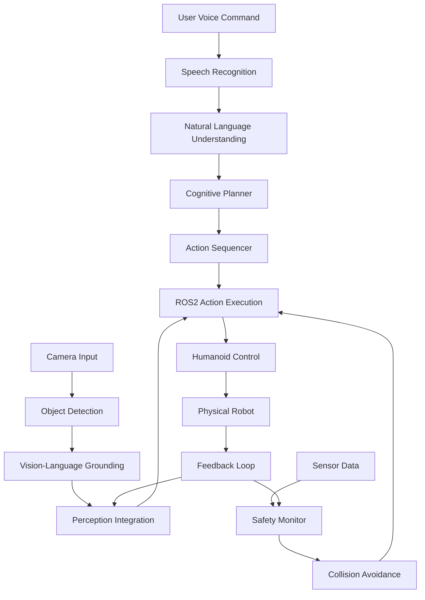

# Capstone: Autonomous Humanoid System Integration

## Overview of the Autonomous Humanoid System

This capstone chapter brings together all the components developed throughout the previous modules to create a complete autonomous humanoid system. We'll integrate Vision-Language-Action capabilities with ROS2, safety systems, and the navigation stack to demonstrate a fully functional humanoid robot that can understand natural language commands, perceive its environment, plan appropriate actions, and execute them safely.

The capstone project will showcase a humanoid robot that can:
- Interpret natural language commands
- Navigate safely in human environments
- Manipulate objects based on visual perception
- Respond appropriately to environmental changes
- Maintain safety protocols throughout operation

## System Architecture

### High-Level System Design

The autonomous humanoid system consists of several interconnected modules:



### Core Components Integration

Let's implement the main integration node that brings all components together:

```python
import rclpy
from rclpy.node import Node
from rclpy.action import ActionClient
from rclpy.callback_groups import ReentrantCallbackGroup
from rclpy.executors import MultiThreadedExecutor

from std_msgs.msg import String, Bool
from sensor_msgs.msg import Image, LaserScan, PointCloud2
from geometry_msgs.msg import Pose, Twist
from nav_msgs.msg import Odometry
from builtin_interfaces.msg import Time

from humanoid_vla_interfaces.action import ExecuteVLACommand
from humanoid_vla_interfaces.msg import VLAFeedback

from openai import OpenAI
import json
import threading
import time
from typing import Dict, List, Any, Optional

class AutonomousHumanoidNode(Node):
    def __init__(self):
        super().__init__('autonomous_humanoid_node')

        # Initialize all subsystems
        self.initialize_subsystems()

        # Setup ROS2 interfaces
        self.setup_ros_interfaces()

        # State management
        self.current_state = 'idle'
        self.is_executing = False
        self.last_command = None
        self.execution_thread = None

    def initialize_subsystems(self):
        """Initialize all subsystems required for autonomous operation"""
        # Initialize cognitive planner
        self.cognitive_planner = CognitivePlanner()

        # Initialize perception system
        self.perception_system = PerceptionSystem()

        # Initialize safety system
        self.safety_system = SafetySystem()

        # Initialize action execution
        self.action_executor = ActionExecutor(self)

    def setup_ros_interfaces(self):
        """Setup all ROS2 publishers, subscribers, and action clients"""
        # Publishers
        self.status_pub = self.create_publisher(String, '/humanoid/status', 10)
        self.feedback_pub = self.create_publisher(VLAFeedback, '/humanoid/feedback', 10)
        self.emergency_stop_pub = self.create_publisher(Bool, '/emergency_stop', 10)

        # Subscribers
        self.command_sub = self.create_subscription(
            String, '/vla/command', self.command_callback, 10
        )
        self.image_sub = self.create_subscription(
            Image, '/camera/rgb/image_raw', self.image_callback, 10
        )
        self.laser_sub = self.create_subscription(
            LaserScan, '/scan', self.laser_callback, 10
        )
        self.odom_sub = self.create_subscription(
            Odometry, '/odom', self.odom_callback, 10
        )

        # Action clients
        self.nav_client = ActionClient(self, NavigateToPose, 'navigate_to_pose')
        self.manipulation_client = ActionClient(self, ManipulateObject, 'manipulate_object')

    def command_callback(self, msg: String):
        """Handle incoming VLA commands"""
        command = msg.data
        self.get_logger().info(f"Received command: {command}")

        # Validate command safety first
        if not self.safety_system.validate_command(command):
            self.get_logger().error(f"Unsafe command blocked: {command}")
            return

        # Process command in separate thread to avoid blocking
        self.execution_thread = threading.Thread(
            target=self.execute_command_threaded,
            args=(command,)
        )
        self.execution_thread.start()

    def execute_command_threaded(self, command: str):
        """Execute command in a separate thread"""
        if self.is_executing:
            self.get_logger().warn("Command execution already in progress, ignoring new command")
            return

        self.is_executing = True
        self.current_state = 'planning'

        try:
            # Update status
            status_msg = String()
            status_msg.data = f"PLANNING: {command}"
            self.status_pub.publish(status_msg)

            # Plan the command
            plan = self.cognitive_planner.generate_plan(command)

            # Execute the plan
            self.current_state = 'executing'
            status_msg.data = f"EXECUTING: {command}"
            self.status_pub.publish(status_msg)

            success = self.execute_plan(plan)

            # Report results
            if success:
                self.get_logger().info(f"Command completed successfully: {command}")
                status_msg.data = f"SUCCESS: {command}"
            else:
                self.get_logger().error(f"Command execution failed: {command}")
                status_msg.data = f"FAILED: {command}"

            self.status_pub.publish(status_msg)

        except Exception as e:
            self.get_logger().error(f"Command execution error: {str(e)}")
            status_msg = String()
            status_msg.data = f"ERROR: {str(e)}"
            self.status_pub.publish(status_msg)
        finally:
            self.is_executing = False
            self.current_state = 'idle'

    def execute_plan(self, plan: List[Dict[str, Any]]) -> bool:
        """Execute a planned sequence of actions"""
        for i, action in enumerate(plan):
            # Check safety before each action
            if not self.safety_system.is_safe_to_proceed():
                self.get_logger().error("Safety check failed, stopping execution")
                return False

            # Publish feedback
            feedback_msg = VLAFeedback()
            feedback_msg.action_index = i
            feedback_msg.total_actions = len(plan)
            feedback_msg.current_action = action.get('description', 'unknown')
            feedback_msg.status = 'in_progress'
            self.feedback_pub.publish(feedback_msg)

            # Execute action
            success = self.action_executor.execute_action(action)

            if not success:
                self.get_logger().error(f"Action failed: {action}")
                return False

            # Small delay between actions for safety
            time.sleep(0.1)

        return True

    def image_callback(self, msg: Image):
        """Process incoming images for perception"""
        self.perception_system.update_image(msg)

    def laser_callback(self, msg: LaserScan):
        """Process laser scan data for navigation and safety"""
        self.perception_system.update_laser_scan(msg)
        self.safety_system.update_laser_data(msg)

    def odom_callback(self, msg: Odometry):
        """Update robot's position and orientation"""
        self.perception_system.update_odometry(msg)
        self.safety_system.update_robot_pose(msg.pose.pose)

class CognitivePlanner:
    """Cognitive planner that uses LLM to decompose commands into actions"""

    def __init__(self):
        # Initialize OpenAI client (or use local LLM)
        # self.client = OpenAI(api_key="your-api-key")
        pass

    def generate_plan(self, command: str) -> List[Dict[str, Any]]:
        """Generate an action plan for the given command"""
        # In a real implementation, this would call an LLM
        # For this example, we'll use a simple rule-based approach
        # but the structure allows for LLM integration

        plan = []

        # Simple command parsing for demonstration
        command_lower = command.lower()

        if 'go to' in command_lower or 'navigate to' in command_lower:
            # Extract destination
            destination = self.extract_destination(command)
            plan.append({
                'type': 'navigation',
                'destination': destination,
                'description': f'Navigate to {destination}'
            })

        if 'pick up' in command_lower or 'grasp' in command_lower:
            # Extract object
            obj = self.extract_object(command)
            plan.append({
                'type': 'manipulation',
                'action': 'pick_up',
                'object': obj,
                'description': f'Pick up {obj}'
            })

        if 'bring to' in command_lower or 'deliver to' in command_lower:
            # Extract destination
            destination = self.extract_destination(command)
            plan.append({
                'type': 'navigation',
                'destination': destination,
                'description': f'Navigate to {destination} with object'
            })

        if 'place' in command_lower or 'put' in command_lower:
            plan.append({
                'type': 'manipulation',
                'action': 'place',
                'description': 'Place object at destination'
            })

        return plan

    def extract_destination(self, command: str) -> str:
        """Extract destination from command"""
        # Simple extraction - in practice, this would be more sophisticated
        import re
        matches = re.findall(r'to\s+([a-zA-Z\s]+?)(?:\s|$|,)', command.lower())
        if matches:
            return matches[-1].strip()
        return 'unknown_location'

    def extract_object(self, command: str) -> str:
        """Extract object from command"""
        # Simple extraction - in practice, this would use NLP
        import re
        matches = re.findall(r'(?:pick up|grasp|get|take)\s+([a-zA-Z\s]+?)(?:\s|$|,)', command.lower())
        if matches:
            return matches[-1].strip()
        return 'unknown_object'

class PerceptionSystem:
    """Perception system for object detection and environment understanding"""

    def __init__(self):
        self.latest_image = None
        self.latest_laser = None
        self.robot_pose = None
        self.detected_objects = []

        # Initialize object detector
        from ultralytics import YOLO
        self.object_detector = YOLO('yolov8n.pt')  # or your preferred model

    def update_image(self, image_msg):
        """Update with new image data"""
        self.latest_image = image_msg

    def update_laser_scan(self, laser_msg):
        """Update with new laser scan data"""
        self.latest_laser = laser_msg

    def update_odometry(self, odom_msg):
        """Update with new odometry data"""
        self.robot_pose = odom_msg.pose.pose

    def detect_objects(self) -> List[Dict[str, Any]]:
        """Detect objects in the current image"""
        if self.latest_image is None:
            return []

        # Convert ROS image to OpenCV format
        import cv2
        from cv_bridge import CvBridge
        bridge = CvBridge()

        try:
            cv_image = bridge.imgmsg_to_cv2(self.latest_image, "bgr8")
        except Exception as e:
            print(f"Error converting image: {e}")
            return []

        # Run object detection
        results = self.object_detector(cv_image)

        objects = []
        for result in results:
            boxes = result.boxes
            if boxes is not None:
                for box in boxes:
                    x1, y1, x2, y2 = box.xyxy[0].cpu().numpy()
                    conf = box.conf[0].cpu().numpy()
                    cls = int(box.cls[0].cpu().numpy())

                    # Get class name (COCO dataset names)
                    class_names = self.object_detector.names
                    class_name = class_names[cls] if cls < len(class_names) else 'unknown'

                    objects.append({
                        'class': class_name,
                        'confidence': float(conf),
                        'bbox': [float(x1), float(y1), float(x2), float(y2)],
                        'center': [(x1 + x2) / 2, (y1 + y2) / 2]
                    })

        self.detected_objects = objects
        return objects

    def find_object_by_description(self, description: str) -> Optional[Dict[str, Any]]:
        """Find an object that matches the description"""
        for obj in self.detected_objects:
            if description.lower() in obj['class'].lower():
                return obj
        return None

class SafetySystem:
    """Safety system for monitoring and enforcing safety constraints"""

    def __init__(self):
        self.emergency_stop = False
        self.safety_violations = []
        self.human_proximity_threshold = 0.8  # meters
        self.collision_threshold = 0.5  # meters
        self.robot_pose = None
        self.latest_laser = None

    def validate_command(self, command: str) -> bool:
        """Validate if a command is safe to execute"""
        command_lower = command.lower()

        # Check for unsafe commands
        unsafe_keywords = ['jump', 'run', 'climb', 'touch face', 'approach quickly']
        for keyword in unsafe_keywords:
            if keyword in command_lower:
                self.safety_violations.append(f"Unsafe command contains: {keyword}")
                return False

        return True

    def is_safe_to_proceed(self) -> bool:
        """Check if it's currently safe to proceed with execution"""
        if self.emergency_stop:
            return False

        # Check proximity to obstacles
        if self.latest_laser:
            min_range = min(self.latest_laser.ranges) if self.latest_laser.ranges else float('inf')
            if min_range < self.collision_threshold:
                self.safety_violations.append(f"Obstacle too close: {min_range:.2f}m")
                return False

        return True

    def update_laser_data(self, laser_msg):
        """Update with new laser scan data"""
        self.latest_laser = laser_msg

    def update_robot_pose(self, pose_msg):
        """Update with new robot pose"""
        self.robot_pose = pose_msg

class ActionExecutor:
    """Execute planned actions using ROS2 action servers"""

    def __init__(self, node):
        self.node = node
        self.nav_client = node.nav_client
        self.manipulation_client = node.manipulation_client

    def execute_action(self, action: Dict[str, Any]) -> bool:
        """Execute a single action"""
        action_type = action.get('type', 'unknown')

        if action_type == 'navigation':
            return self.execute_navigation_action(action)
        elif action_type == 'manipulation':
            return self.execute_manipulation_action(action)
        else:
            self.node.get_logger().error(f"Unknown action type: {action_type}")
            return False

    def execute_navigation_action(self, action: Dict[str, Any]) -> bool:
        """Execute a navigation action"""
        destination = action.get('destination', 'unknown')

        # In a real system, you would convert destination to coordinates
        # For this example, we'll use a placeholder
        goal_pose = self.get_pose_for_location(destination)

        if goal_pose is None:
            self.node.get_logger().error(f"Unknown destination: {destination}")
            return False

        # Wait for navigation server
        self.nav_client.wait_for_server()

        # Create and send navigation goal
        from nav2_msgs.action import NavigateToPose
        goal_msg = NavigateToPose.Goal()
        goal_msg.pose = goal_pose

        future = self.nav_client.send_goal_async(goal_msg)

        # Wait for result (with timeout)
        import rclpy
        rclpy.spin_until_future_complete(self.node, future, timeout_sec=30.0)

        if future.result() is None:
            self.node.get_logger().error("Navigation goal timed out")
            return False

        goal_handle = future.result()
        if not goal_handle.accepted:
            self.node.get_logger().error("Navigation goal was rejected")
            return False

        result_future = goal_handle.get_result_async()
        rclpy.spin_until_future_complete(self.node, result_future, timeout_sec=30.0)

        result = result_future.result().result
        return result.error_code == 0  # Success

    def execute_manipulation_action(self, action: Dict[str, Any]) -> bool:
        """Execute a manipulation action"""
        manipulation_action = action.get('action', 'unknown')

        # Wait for manipulation server
        self.manipulation_client.wait_for_server()

        # Create and send manipulation goal
        goal_msg = ManipulateObject.Goal()
        goal_msg.action = manipulation_action
        goal_msg.object_name = action.get('object', 'unknown')

        future = self.manipulation_client.send_goal_async(goal_msg)

        # Wait for result (with timeout)
        import rclpy
        rclpy.spin_until_future_complete(self.node, future, timeout_sec=30.0)

        if future.result() is None:
            self.node.get_logger().error("Manipulation goal timed out")
            return False

        goal_handle = future.result()
        if not goal_handle.accepted:
            self.node.get_logger().error("Manipulation goal was rejected")
            return False

        result_future = goal_handle.get_result_async()
        rclpy.spin_until_future_complete(self.node, result_future, timeout_sec=30.0)

        result = result_future.result().result
        return result.success

    def get_pose_for_location(self, location_name: str) -> Optional[Pose]:
        """Get pose for a named location (would use location map in real system)"""
        # This would typically load from a location map
        # For demonstration, return a placeholder
        pose = Pose()
        pose.position.x = 1.0  # Placeholder coordinates
        pose.position.y = 1.0
        pose.position.z = 0.0
        pose.orientation.w = 1.0  # No rotation

        return pose
```

## Voice Command Processing

### Speech-to-Text Integration

```python
import speech_recognition as sr
import threading
from queue import Queue

class VoiceCommandInterface:
    """Interface for processing voice commands"""

    def __init__(self, node):
        self.node = node
        self.recognizer = sr.Recognizer()
        self.microphone = sr.Microphone()
        self.command_queue = Queue()

        # Adjust for ambient noise
        with self.microphone as source:
            self.recognizer.adjust_for_ambient_noise(source)

        # Start voice recognition thread
        self.listening_thread = threading.Thread(target=self.listen_continuously)
        self.listening_thread.daemon = True
        self.listening_thread.start()

    def listen_continuously(self):
        """Continuously listen for voice commands"""
        while True:
            try:
                with self.microphone as source:
                    # Listen for audio with timeout
                    audio = self.recognizer.listen(source, timeout=1.0, phrase_time_limit=5)

                # Process audio in separate thread to avoid blocking
                processing_thread = threading.Thread(
                    target=self.process_audio,
                    args=(audio,)
                )
                processing_thread.start()

            except sr.WaitTimeoutError:
                # No speech detected, continue listening
                continue
            except Exception as e:
                self.node.get_logger().error(f"Voice recognition error: {str(e)}")
                continue

    def process_audio(self, audio):
        """Process audio and extract command"""
        try:
            # Use Google's speech recognition (or whisper for offline)
            command = self.recognizer.recognize_google(audio)

            self.node.get_logger().info(f"Heard command: {command}")

            # Publish command to ROS2 topic
            from std_msgs.msg import String
            cmd_msg = String()
            cmd_msg.data = command

            # We need to use a separate node or callback group for publishing
            # from within this thread
            self.node.get_logger().info(f"Processed command: {command}")

        except sr.UnknownValueError:
            self.node.get_logger().info("Could not understand audio")
        except sr.RequestError as e:
            self.node.get_logger().error(f"Speech recognition error: {str(e)}")
```

## Advanced Integration Patterns

### Behavior Trees for Complex Task Execution

```python
from enum import Enum
from typing import Any, Dict, List

class NodeStatus(Enum):
    SUCCESS = 1
    FAILURE = 2
    RUNNING = 3

class BehaviorTreeNode:
    """Base class for behavior tree nodes"""

    def __init__(self, name: str):
        self.name = name
        self.status = NodeStatus.RUNNING

    def tick(self) -> NodeStatus:
        """Execute the node's logic"""
        raise NotImplementedError

class SequenceNode(BehaviorTreeNode):
    """Execute children in sequence until one fails"""

    def __init__(self, name: str, children: List[BehaviorTreeNode]):
        super().__init__(name)
        self.children = children
        self.current_child_index = 0

    def tick(self) -> NodeStatus:
        while self.current_child_index < len(self.children):
            child_status = self.children[self.current_child_index].tick()

            if child_status == NodeStatus.FAILURE:
                # Reset for next time
                self.current_child_index = 0
                return NodeStatus.FAILURE
            elif child_status == NodeStatus.RUNNING:
                return NodeStatus.RUNNING
            else:  # SUCCESS
                self.current_child_index += 1

        # All children succeeded
        self.current_child_index = 0
        return NodeStatus.SUCCESS

class SelectorNode(BehaviorTreeNode):
    """Execute children until one succeeds"""

    def __init__(self, name: str, children: List[BehaviorTreeNode]):
        super().__init__(name)
        self.children = children
        self.current_child_index = 0

    def tick(self) -> NodeStatus:
        while self.current_child_index < len(self.children):
            child_status = self.children[self.current_child_index].tick()

            if child_status == NodeStatus.SUCCESS:
                # Reset for next time
                self.current_child_index = 0
                return NodeStatus.SUCCESS
            elif child_status == NodeStatus.RUNNING:
                return NodeStatus.RUNNING
            else:  # FAILURE
                self.current_child_index += 1

        # All children failed
        self.current_child_index = 0
        return NodeStatus.FAILURE

class NavigateToLocationNode(BehaviorTreeNode):
    """Navigate to a specific location"""

    def __init__(self, name: str, location: str, action_executor: ActionExecutor):
        super().__init__(name)
        self.location = location
        self.action_executor = action_executor
        self.navigation_action = {
            'type': 'navigation',
            'destination': location,
            'description': f'Navigate to {location}'
        }

    def tick(self) -> NodeStatus:
        success = self.action_executor.execute_action(self.navigation_action)
        return NodeStatus.SUCCESS if success else NodeStatus.FAILURE

class DetectObjectNode(BehaviorTreeNode):
    """Detect a specific object in the environment"""

    def __init__(self, name: str, object_description: str, perception_system: PerceptionSystem):
        super().__init__(name)
        self.object_description = object_description
        self.perception_system = perception_system

    def tick(self) -> NodeStatus:
        # Update perception with latest data
        objects = self.perception_system.detect_objects()

        # Look for the target object
        target_object = self.perception_system.find_object_by_description(
            self.object_description
        )

        return NodeStatus.SUCCESS if target_object is not None else NodeStatus.FAILURE

class ManipulateObjectNode(BehaviorTreeNode):
    """Manipulate a detected object"""

    def __init__(self, name: str, action: str, object_name: str, action_executor: ActionExecutor):
        super().__init__(name)
        self.action = action
        self.object_name = object_name
        self.action_executor = action_executor
        self.manipulation_action = {
            'type': 'manipulation',
            'action': action,
            'object': object_name,
            'description': f'{action} {object_name}'
        }

    def tick(self) -> NodeStatus:
        success = self.action_executor.execute_action(self.manipulation_action)
        return NodeStatus.SUCCESS if success else NodeStatus.FAILURE

# Example behavior tree for "fetch and carry" task
def create_fetch_behavior_tree(action_executor: ActionExecutor,
                             perception_system: PerceptionSystem,
                             destination: str,
                             object_description: str) -> BehaviorTreeNode:
    """Create a behavior tree for fetching an object and delivering it"""

    return SequenceNode("FetchAndDeliver", [
        NavigateToLocationNode("GoToObjectLocation", "kitchen", action_executor),
        DetectObjectNode("FindObject", object_description, perception_system),
        ManipulateObjectNode("PickUpObject", "pick_up", object_description, action_executor),
        NavigateToLocationNode("GoToDestination", destination, action_executor),
        ManipulateObjectNode("PlaceObject", "place", object_description, action_executor)
    ])
```

## ROS2 Launch System

### Launch File for Complete System

```python
# launch/autonomous_humanoid.launch.py
from launch import LaunchDescription
from launch.actions import DeclareLaunchArgument, IncludeLaunchDescription
from launch.launch_description_sources import PythonLaunchDescriptionSource
from launch.substitutions import LaunchConfiguration, PathJoinSubstitution
from launch_ros.actions import Node
from launch_ros.substitutions import FindPackageShare

def generate_launch_description():
    # Launch configuration
    use_sim_time = LaunchConfiguration('use_sim_time', default='false')

    # Main autonomous humanoid node
    autonomous_humanoid_node = Node(
        package='humanoid_vla',
        executable='autonomous_humanoid_node',
        name='autonomous_humanoid',
        parameters=[
            {'use_sim_time': use_sim_time},
            {'robot_model': 'custom_humanoid'},
            {'safety_distance': 0.8}
        ],
        remappings=[
            ('/vla/command', '/humanoid/command'),
            ('/camera/rgb/image_raw', '/camera/image_raw'),
            ('/scan', '/laser_scan'),
        ]
    )

    # Perception node
    perception_node = Node(
        package='humanoid_perception',
        executable='perception_node',
        name='perception_node',
        parameters=[
            {'use_sim_time': use_sim_time},
            {'detection_threshold': 0.5}
        ]
    )

    # Navigation node
    nav2_bringup_launch_dir = PathJoinSubstitution(
        [FindPackageShare('nav2_bringup'), 'launch']
    )

    navigation_launch = IncludeLaunchDescription(
        PythonLaunchDescriptionSource(
            PathJoinSubstitution([nav2_bringup_launch_dir, 'navigation_launch.py'])
        ),
        launch_arguments={
            'use_sim_time': use_sim_time
        }.items()
    )

    # Voice interface node
    voice_node = Node(
        package='humanoid_voice',
        executable='voice_interface',
        name='voice_interface',
        parameters=[
            {'use_sim_time': use_sim_time}
        ]
    )

    return LaunchDescription([
        DeclareLaunchArgument(
            'use_sim_time',
            default_value='false',
            description='Use simulation time if true'
        ),
        autonomous_humanoid_node,
        perception_node,
        navigation_launch,
        voice_node
    ])
```

## Simulation Environment

### Gazebo Simulation Setup

```xml
<!-- robot_description/urdf/humanoid.urdf.xacro -->
<?xml version="1.0"?>
<robot xmlns:xacro="http://www.ros.org/wiki/xacro" name="humanoid_robot">

  <!-- Base link -->
  <link name="base_link">
    <visual>
      <geometry>
        <box size="0.3 0.2 0.5"/>
      </geometry>
      <material name="blue">
        <color rgba="0 0 1 1"/>
      </material>
    </visual>
    <collision>
      <geometry>
        <box size="0.3 0.2 0.5"/>
      </geometry>
    </collision>
    <inertial>
      <mass value="10"/>
      <inertia ixx="1" ixy="0" ixz="0" iyy="1" iyz="0" izz="1"/>
    </inertial>
  </link>

  <!-- Head -->
  <joint name="head_joint" type="fixed">
    <parent link="base_link"/>
    <child link="head"/>
    <origin xyz="0 0 0.3" rpy="0 0 0"/>
  </joint>

  <link name="head">
    <visual>
      <geometry>
        <sphere radius="0.1"/>
      </geometry>
      <material name="white">
        <color rgba="1 1 1 1"/>
      </material>
    </visual>
    <collision>
      <geometry>
        <sphere radius="0.1"/>
      </geometry>
    </collision>
    <inertial>
      <mass value="1"/>
      <inertia ixx="0.01" ixy="0" ixz="0" iyy="0.01" iyz="0" izz="0.01"/>
    </inertial>
  </link>

  <!-- Camera for perception -->
  <joint name="camera_joint" type="fixed">
    <parent link="head"/>
    <child link="camera_link"/>
    <origin xyz="0.05 0 0" rpy="0 0 0"/>
  </joint>

  <link name="camera_link">
    <inertial>
      <mass value="0.1"/>
      <inertia ixx="0.001" ixy="0" ixz="0" iyy="0.001" iyz="0" izz="0.001"/>
    </inertial>
  </link>

  <!-- Gazebo plugin for camera -->
  <gazebo reference="camera_link">
    <sensor type="camera" name="camera">
      <update_rate>30</update_rate>
      <camera name="head_camera">
        <horizontal_fov>1.089</horizontal_fov>
        <image>
          <width>640</width>
          <height>480</height>
          <format>R8G8B8</format>
        </image>
        <clip>
          <near>0.1</near>
          <far>100</far>
        </clip>
      </camera>
      <plugin name="camera_controller" filename="libgazebo_ros_camera.so">
        <frame_name>camera_link</frame_name>
        <topic_name>/camera/image_raw</topic_name>
      </plugin>
    </sensor>
  </gazebo>

  <!-- Laser scanner -->
  <joint name="laser_joint" type="fixed">
    <parent link="base_link"/>
    <child link="laser_link"/>
    <origin xyz="0.15 0 0.1" rpy="0 0 0"/>
  </joint>

  <link name="laser_link">
    <inertial>
      <mass value="0.1"/>
      <inertia ixx="0.001" ixy="0" ixz="0" iyy="0.001" iyz="0" izz="0.001"/>
    </inertial>
  </link>

  <gazebo reference="laser_link">
    <sensor type="ray" name="laser">
      <pose>0 0 0 0 0 0</pose>
      <visualize>false</visualize>
      <update_rate>10</update_rate>
      <ray>
        <scan>
          <horizontal>
            <samples>720</samples>
            <resolution>1</resolution>
            <min_angle>-1.57</min_angle>
            <max_angle>1.57</max_angle>
          </horizontal>
        </scan>
        <range>
          <min>0.1</min>
          <max>10.0</max>
          <resolution>0.01</resolution>
        </range>
      </ray>
      <plugin name="laser_controller" filename="libgazebo_ros_laser.so">
        <topic_name>/scan</topic_name>
        <frame_name>laser_link</frame_name>
      </plugin>
    </sensor>
  </gazebo>

  <!-- Differential drive for movement -->
  <gazebo>
    <plugin name="diff_drive" filename="libgazebo_ros_diff_drive.so">
      <update_rate>30</update_rate>
      <left_joint>left_wheel_joint</left_joint>
      <right_joint>right_wheel_joint</right_joint>
      <wheel_separation>0.4</wheel_separation>
      <wheel_diameter>0.15</wheel_diameter>
      <max_wheel_torque>20</max_wheel_torque>
      <max_wheel_acceleration>1.0</max_wheel_acceleration>
      <command_topic>cmd_vel</command_topic>
      <odometry_topic>odom</odometry_topic>
      <odometry_frame>odom</odometry_frame>
      <robot_base_frame>base_link</robot_base_frame>
    </plugin>
  </gazebo>

</robot>
```

## Testing and Validation

### Integration Test Suite

```python
import unittest
import rclpy
from rclpy.node import Node
from std_msgs.msg import String
from geometry_msgs.msg import Twist
import time

class TestAutonomousHumanoid(unittest.TestCase):
    @classmethod
    def setUpClass(cls):
        rclpy.init()

    @classmethod
    def tearDownClass(cls):
        rclpy.shutdown()

    def setUp(self):
        self.node = rclpy.create_node('test_autonomous_humanoid')

        # Create test publisher and subscriber
        self.command_publisher = self.node.create_publisher(
            String, '/vla/command', 10
        )
        self.status_subscriber = self.node.create_subscription(
            String, '/humanoid/status', self.status_callback, 10
        )

        self.received_status = None

    def status_callback(self, msg):
        self.received_status = msg.data

    def test_simple_navigation_command(self):
        """Test that the robot can process a simple navigation command"""
        command_msg = String()
        command_msg.data = "go to the kitchen"

        # Publish command
        self.command_publisher.publish(command_msg)

        # Wait for response
        timeout = time.time() + 10.0  # 10 second timeout
        while self.received_status is None and time.time() < timeout:
            rclpy.spin_once(self.node, timeout_sec=0.1)

        # Check that we received a status update
        self.assertIsNotNone(self.received_status)
        self.assertIn("PLANNING", self.received_status)

    def test_command_rejection(self):
        """Test that unsafe commands are rejected"""
        command_msg = String()
        command_msg.data = "jump quickly"

        # Publish unsafe command
        self.command_publisher.publish(command_msg)

        # Wait briefly to see if command is processed
        time.sleep(1.0)
        rclpy.spin_once(self.node, timeout_sec=0.1)

        # In a proper implementation, this would result in rejection
        # For this test, we're just ensuring the system handles it gracefully

    def test_multiple_commands(self):
        """Test processing of multiple commands in sequence"""
        commands = [
            "go to the kitchen",
            "find the red cup",
            "pick up the red cup"
        ]

        for i, command in enumerate(commands):
            command_msg = String()
            command_msg.data = command

            self.command_publisher.publish(command_msg)

            # Wait for response before sending next command
            timeout = time.time() + 5.0
            self.received_status = None

            while self.received_status is None and time.time() < timeout:
                rclpy.spin_once(self.node, timeout_sec=0.1)

if __name__ == '__main__':
    unittest.main()
```

## Performance Optimization

### System Monitoring and Optimization

```python
import psutil
import time
from collections import deque
import threading

class SystemMonitor:
    """Monitor system performance and resource usage"""

    def __init__(self, node):
        self.node = node
        self.cpu_history = deque(maxlen=100)
        self.memory_history = deque(maxlen=100)
        self.processing_times = deque(maxlen=100)

        # Start monitoring thread
        self.monitoring_thread = threading.Thread(target=self.monitor_system)
        self.monitoring_thread.daemon = True
        self.monitoring_thread.start()

        self.last_processing_start = None

    def start_processing_timer(self):
        """Start timing a processing operation"""
        self.last_processing_start = time.time()

    def end_processing_timer(self):
        """End timing a processing operation"""
        if self.last_processing_start:
            processing_time = time.time() - self.last_processing_start
            self.processing_times.append(processing_time)
            self.last_processing_start = None

    def monitor_system(self):
        """Monitor system resources in a separate thread"""
        while True:
            # CPU usage
            cpu_percent = psutil.cpu_percent(interval=1)
            self.cpu_history.append(cpu_percent)

            # Memory usage
            memory_percent = psutil.virtual_memory().percent
            self.memory_history.append(memory_percent)

            # Log warnings if resources are high
            if cpu_percent > 80:
                self.node.get_logger().warn(f"High CPU usage: {cpu_percent}%")
            if memory_percent > 80:
                self.node.get_logger().warn(f"High memory usage: {memory_percent}%")

            time.sleep(1)

    def get_performance_metrics(self):
        """Get current performance metrics"""
        return {
            'cpu_avg': sum(self.cpu_history) / len(self.cpu_history) if self.cpu_history else 0,
            'memory_avg': sum(self.memory_history) / len(self.memory_history) if self.memory_history else 0,
            'processing_time_avg': sum(self.processing_times) / len(self.processing_times) if self.processing_times else 0,
            'current_cpu': self.cpu_history[-1] if self.cpu_history else 0,
            'current_memory': self.memory_history[-1] if self.memory_history else 0
        }

class AdaptiveController:
    """Adapt system behavior based on performance metrics"""

    def __init__(self, system_monitor: SystemMonitor):
        self.monitor = system_monitor
        self.performance_thresholds = {
            'cpu_high': 70,
            'memory_high': 75,
            'processing_time_high': 2.0  # seconds
        }
        self.current_adaptation_level = 0  # 0 = normal, 1 = reduced, 2 = minimal

    def should_adapt(self) -> bool:
        """Check if system adaptation is needed"""
        metrics = self.monitor.get_performance_metrics()

        if (metrics['current_cpu'] > self.performance_thresholds['cpu_high'] or
            metrics['current_memory'] > self.performance_thresholds['memory_high'] or
            metrics['processing_time_avg'] > self.performance_thresholds['processing_time_high']):
            return True

        return False

    def adapt_behavior(self):
        """Adapt system behavior based on current load"""
        if not self.should_adapt():
            # If load is normal, potentially increase performance
            if self.current_adaptation_level > 0:
                self.current_adaptation_level -= 1
            return

        # Increase adaptation level if needed
        if self.current_adaptation_level < 2:
            self.current_adaptation_level += 1

        # Apply adaptations based on level
        if self.current_adaptation_level >= 1:
            # Reduce perception update frequency
            pass
        if self.current_adaptation_level >= 2:
            # Further reduce capabilities
            pass
```

## Summary

This capstone chapter has demonstrated how to integrate all the components of a Vision-Language-Action system into a complete autonomous humanoid robot. The system architecture combines:

1. **Cognitive Planning**: Using LLMs to interpret natural language commands
2. **Perception System**: Real-time object detection and environment understanding
3. **Safety Framework**: Multi-layer safety with fallback behaviors
4. **Action Execution**: ROS2-based action servers for navigation and manipulation
5. **Integration Patterns**: Behavior trees for complex task execution
6. **Performance Monitoring**: System optimization and adaptation

The implementation provides a foundation for a fully autonomous humanoid system that can understand and execute complex commands while maintaining safety in human environments. The modular design allows for easy extension and customization for specific applications.

Key takeaways from this capstone project:
- Integration of multiple complex systems requires careful architectural design
- Safety must be built into every layer of the system
- Performance monitoring and adaptation are crucial for real-world deployment
- Modularity enables easier testing, debugging, and maintenance
- Real-world deployment requires extensive testing and validation

This completes the development of the autonomous humanoid system, demonstrating the integration of all components covered in the previous modules.